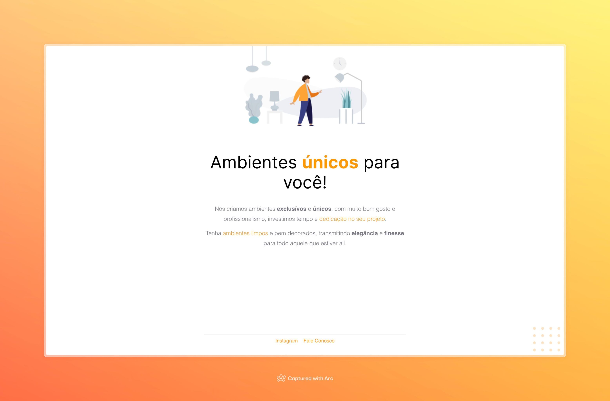

# Web Page Ambientes

This is a learning project to practice html and css basic features, using a Figma project as a base for the design.

The page was deployed using Vercel [Access Here](https://web-page-ambientes.vercel.app/)
